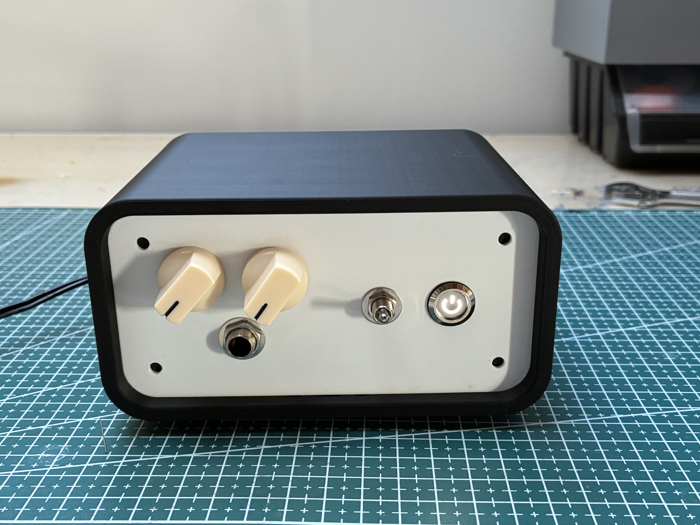
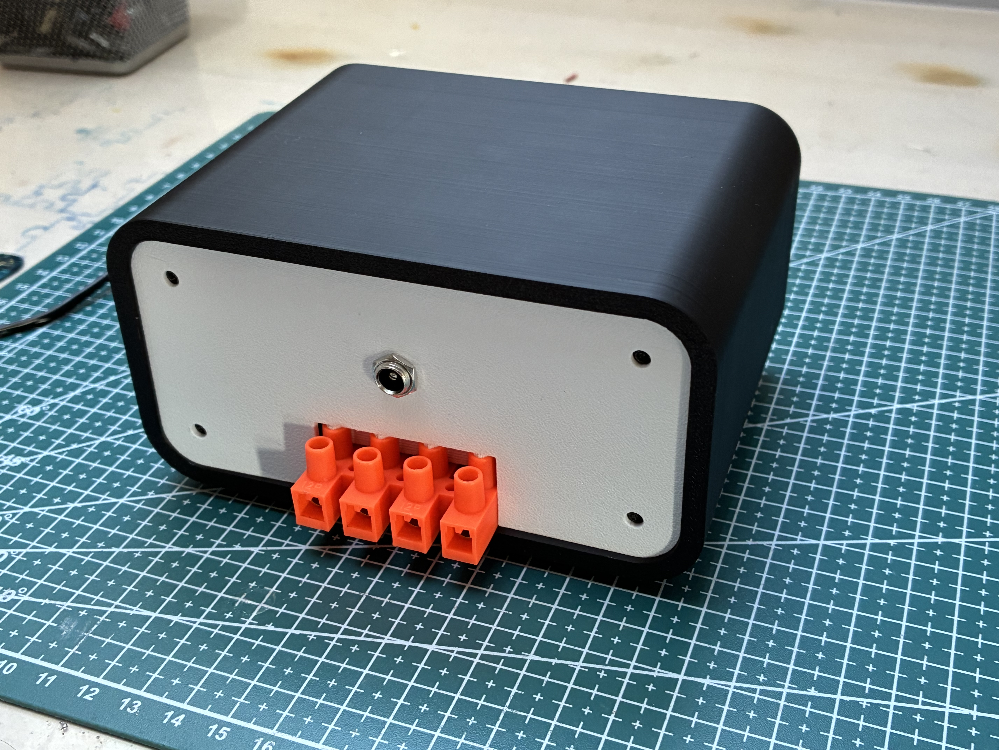

# PAM8403 audio amplifier

A small audio amplifier based on the **PAM8403** class-D amplifier chip, intended for 8 Ω loudspeakers.
The source can be connected with a cable or over Bluetooth.

The enclosure is 3D printed: a black shell with light front and back panels.

## Front panel

- two control knobs
- 6.35 mm (1/4") jack input
- toggle switch
- illuminated power button

## Back panel

- DC power jack
- screw terminal block for connecting the speakers

## Files

- [`wzmacniacz.pdf`](wzmacniacz.pdf) – project documentation
